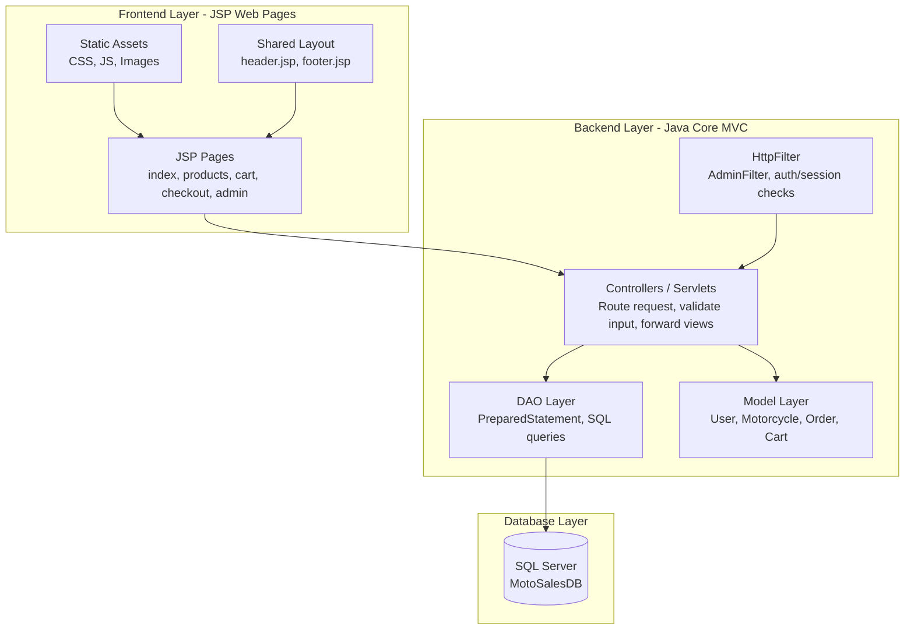

<p align="center">
  
  
  
  
  
  
</p>

<h1 align="center">MotoSales Appointment System</h1>
<p align="center">
  <strong>Website quản lý bán xe máy và đặt lịch hẹn nhận xe tại showroom theo mô hình MVC</strong>
</p>

<p align="center">
  <a href="https://github.com/Hungle2910/motorcycle-sales-appointment-system/actions/workflows/ci.yml">
    
  </a>
  
  
  
</p>

---

## Giới Thiệu Dự Án

**MotoSales Appointment System** là đồ án web Java cho môn **PRJ301**, mô phỏng quy trình thương mại điện tử trong lĩnh vực bán xe máy. Hệ thống tập trung vào các nghiệp vụ cốt lõi của một showroom: khách hàng xem danh sách xe, lọc sản phẩm, xem chi tiết, thêm vào giỏ hàng, đăng ký lịch hẹn nhận xe và theo dõi lịch sử đặt xe.

Dự án được triển khai theo mô hình **MVC với Java Servlet, JSP, JSTL và DAO**, sử dụng **SQL Server** làm hệ quản trị cơ sở dữ liệu chính. Phạm vi đồ án không tích hợp cổng thanh toán tiền thật; thay vào đó, hệ thống ưu tiên logic CRUD, quản lý session, phân quyền người dùng và quy trình xử lý đơn đặt xe.

---

## Mục Tiêu Hệ Thống

- Xây dựng website quản lý và đặt lịch hẹn mua xe máy theo chuẩn Java Web PRJ301.
- Tách rõ phần **Frontend JSP/static assets** và **Backend Java Servlet/DAO/model/filter** để nhóm dễ phối hợp.
- Lưu trữ dữ liệu bằng **SQL Server** với schema rõ ràng cho users, brands, motorcycles, carts, orders và order_items.
- Mô phỏng đầy đủ luồng khách hàng từ xem xe đến đặt lịch nhận xe tại showroom.
- Cung cấp khu vực admin để quản lý xe máy, hãng xe, đơn đặt và tài khoản người dùng.
- Thiết lập repository GitHub chuyên nghiệp với branch `dev`, CI, milestones, issues, project board và phân công nhiệm vụ.

---

## Phạm Vi Chức Năng

### Khách Hàng

- Đăng ký tài khoản mới.
- Đăng nhập, đăng xuất và duy trì phiên làm việc bằng session.
- Xem trang chủ với danh sách xe mới cập nhật.
- Xem danh sách xe máy và lọc theo hãng, giá, từ khóa hoặc thông số.
- Xem chi tiết xe gồm hãng, model, màu sắc, phân khối, giá, tồn kho, ảnh và mô tả.
- Thêm xe vào giỏ hàng lưu trong session.
- Cập nhật số lượng hoặc xóa sản phẩm khỏi giỏ hàng.
- Gửi form checkout để đăng ký lịch hẹn nhận xe tại showroom.
- Xem lịch sử đơn đặt và trạng thái xử lý.

### Quản Trị Viên

- Truy cập khu vực `/admin/*` thông qua `AdminFilter`.
- Xem dashboard tổng quan.
- CRUD hãng xe.
- CRUD xe máy.
- Quản lý đơn đặt xe và cập nhật trạng thái.
- Quản lý tài khoản người dùng và phân quyền.
- Kiểm soát dữ liệu qua DAO, không viết SQL trực tiếp trong JSP.

### Ràng Buộc Đồ Án

- Không tích hợp thanh toán thật.
- Không dùng framework backend nặng như Spring Boot cho phần lõi PRJ301.
- Logic nghiệp vụ đặt trong Servlet/DAO/service-like helper, không đặt trong JSP.
- SQL thao tác qua `PreparedStatement` để giảm rủi ro SQL injection.

---

## Kiến Trúc Hệ Thống



### Mô hình MVC trong dự án

| Thành phần | Vai trò | Vị trí |
| --- | --- | --- |
| **Model** | Lớp đại diện dữ liệu như user, xe máy, đơn hàng | `backend/src/main/java/com/motosales/model` |
| **View** | JSP render giao diện cho khách hàng và admin | `backend/src/main/webapp` |
| **Controller** | Servlet nhận request, gọi DAO, forward JSP | `backend/src/main/java/com/motosales/controller` |
| **DAO** | Truy vấn SQL Server bằng JDBC | `backend/src/main/java/com/motosales/dao` |
| **Filter** | Kiểm tra quyền truy cập admin/session | `backend/src/main/java/com/motosales/filter` |
| **Config/Util** | Cấu hình DB URL và helper kết nối | `backend/src/main/java/com/motosales/config`, `util` |

---

## Stack Công Nghệ

| Phân hệ | Công nghệ | Ghi chú |
| --- | --- | --- |
| **Backend** | Java Core, Java Servlet 4.0, JDBC | Phù hợp Apache Tomcat 9 và môn PRJ301 |
| **Frontend** | JSP, JSTL, HTML5, CSS3, JavaScript | Có thể tích hợp Bootstrap 5 cho UI |
| **Database** | SQL Server | Database chính theo yêu cầu dự án |
| **Web Server** | Apache Tomcat | Deploy WAR artifact |
| **IDE** | NetBeans 13 | Theo specification gốc |
| **Build Tool** | Maven | Build file WAR `motosales.war` |
| **DevOps** | GitHub Actions, GitHub Projects | CI build backend và quản lý task |
| **Local DB Helper** | Docker Compose | Chạy SQL Server local nhanh |

---

## Cấu Trúc Thư Mục Dự Án

```text
motorcycle-sales-appointment-system/
├── .github/
│   ├── CODEOWNERS                         # Phân quyền review theo khu vực code
│   ├── ISSUE_TEMPLATE/
│   │   └── feature_task.yml               # Mẫu issue task
│   └── workflows/
│       ├── ci.yml                         # CI build backend WAR
│       └── cd.yml                         # Placeholder checklist deploy
├── backend/
│   ├── pom.xml                            # Maven WAR project
│   └── src/main/
│       ├── java/com/motosales/
│       │   ├── config/                    # DatabaseConfig
│       │   ├── controller/                # Java Servlet controllers
│       │   ├── dao/                       # Data Access Object, JDBC queries
│       │   ├── filter/                    # AdminFilter, auth/session filter
│       │   ├── model/                     # Entity/model classes
│       │   └── util/                      # DatabaseConnection helper
│       └── webapp/
│           ├── WEB-INF/
│           │   └── web.xml                # Web app config for Tomcat
│           ├── admin/                     # Admin JSP pages
│           │   ├── dashboard.jsp
│           │   ├── manage-brand.jsp
│           │   ├── manage-order.jsp
│           │   ├── manage-product.jsp
│           │   └── manage-user.jsp
│           ├── assets/
│           │   ├── css/style.css
│           │   ├── js/main.js
│           │   └── images/
│           ├── common/
│           │   ├── header.jsp
│           │   └── footer.jsp
│           ├── index.jsp
│           ├── products.jsp
│           ├── product-detail.jsp
│           ├── cart.jsp
│           ├── checkout.jsp
│           ├── order-history.jsp
│           ├── login.jsp
│           └── register.jsp
├── database/
│   ├── schema.sql                         # SQL Server DDL
│   └── seed.sql                           # Dữ liệu mẫu
├── docs/
│   └── project-management/
│       └── task-breakdown.md              # Phân chia milestone/team/task
├── frontend/
│   └── handoff/
│       └── README.md                      # Quy tắc bàn giao frontend JSP/assets
├── docker-compose.yml                     # SQL Server local container
├── .env.example                           # Mẫu biến môi trường DB
└── README.md
```

---

## Thiết Kế Cơ Sở Dữ Liệu

Database chính: **MotoSalesDB** trên SQL Server.

### Bảng dữ liệu chính

| Bảng | Mục đích |
| --- | --- |
| `users` | Tài khoản khách hàng/admin, email, password hash, role, trạng thái active |
| `brands` | Hãng xe như Honda, Yamaha, Piaggio |
| `motorcycles` | Xe máy, giá, tồn kho, mô tả, ảnh, hãng |
| `carts` | Giỏ hàng theo user |
| `cart_items` | Chi tiết xe trong giỏ hàng |
| `orders` | Đơn đặt xe, tổng tiền, trạng thái, ngày hẹn, showroom |
| `order_items` | Chi tiết xe trong từng đơn đặt |

### Trạng thái đơn hàng đề xuất

| Status | Ý nghĩa |
| --- | --- |
| `PENDING` | Khách vừa gửi lịch hẹn |
| `CONFIRMED` | Admin xác nhận lịch hẹn |
| `COMPLETED` | Khách đã nhận xe/hoàn tất quy trình |
| `CANCELLED` | Đơn bị hủy |

### Setup database

Các script nằm trong:

- `database/schema.sql`
- `database/seed.sql`

---

## Hướng Dẫn Cài Đặt & Chạy Local

### 1. Yêu cầu môi trường

- **Java JDK 17** hoặc phiên bản tương thích với Maven project.
- **Apache Maven 3.9+**.
- **Apache Tomcat 9.x**.
- **SQL Server 2019/2022** hoặc Docker Desktop để chạy SQL Server container.
- **NetBeans 13** nếu phát triển theo đúng môi trường môn học.
- **Git** và **GitHub CLI** nếu làm việc với issue/project board.

### 2. Quy định cổng mặc định

| Dịch vụ | Cổng | Địa chỉ |
| --- | --- | --- |
| Apache Tomcat | `8080` | `http://localhost:8080/motosales` |
| SQL Server | `1433` | `jdbc:sqlserver://localhost:1433;databaseName=MotoSalesDB` |
| GitHub Project | — | [Selling Car Delivery](https://github.com/users/Hungle2910/projects/3) |

### 3. Chạy SQL Server bằng Docker

```powershell
docker compose up -d
```

Container mặc định:

- User: `sa`
- Password: `YourStrongPassword123`
- Port: `1433`

### 4. Tạo database và seed dữ liệu

```powershell
sqlcmd -S localhost,1433 -U sa -P YourStrongPassword123 -i database/schema.sql
sqlcmd -S localhost,1433 -U sa -P YourStrongPassword123 -i database/seed.sql
```

Nếu dùng SQL Server Management Studio, mở lần lượt `database/schema.sql` và `database/seed.sql`, sau đó execute.

### 5. Cấu hình biến môi trường

Tạo file `.env` từ `.env.example` hoặc cấu hình trực tiếp trong IDE/Tomcat:

```env
DB_URL=jdbc:sqlserver://localhost:1433;databaseName=MotoSalesDB;encrypt=true;trustServerCertificate=true
DB_USER=sa
DB_PASSWORD=YourStrongPassword123
APP_ENV=local
```

### 6. Build file WAR

```powershell
cd backend
mvn clean package
```

Artifact sau khi build:

```text
backend/target/motosales.war
```

### 7. Deploy lên Apache Tomcat

1. Copy `backend/target/motosales.war`.
2. Paste vào thư mục `webapps/` của Tomcat.
3. Start Tomcat.
4. Truy cập:

```text
http://localhost:8080/motosales
```

---

## Quy Trình Làm Việc Nhóm

Dự án dùng nhánh `dev` làm nhánh tích hợp chính, tương tự cách setup ở các repo workshop khác.

```text
Clone repo
  -> checkout dev
  -> tạo feature branch
  -> code theo issue được assign
  -> test local
  -> push branch
  -> tạo Pull Request vào dev
  -> CI build
  -> review
  -> merge
```

### Branch convention

| Nhánh | Mục đích |
| --- | --- |
| `main` | Bản ổn định để nộp/bàn giao |
| `dev` | Nhánh tích hợp chính |
| `feature/frontend-ui` | Giao diện JSP, CSS, JS |
| `feature/backend-database` | SQL Server, DAO, model |
| `feature/backend-servlets` | Servlet, session, auth, admin flow |
| `fix/<short-name>` | Sửa lỗi cụ thể |

### Quy tắc commit đề xuất

```text
feat: add product listing page
feat: implement checkout servlet
fix: validate empty cart before checkout
docs: update database setup guide
chore: configure github workflow
```

### GitHub Project

Backlog được quản lý tại:

[Selling Car Delivery](https://github.com/users/Hungle2910/projects/3)

Project board đang có các field chính:

- `Status`: Backlog, Ready, In progress, In review, Done
- `Team`: Backend, Frontend, Database
- `Developer`: Hungle2910, Ram273825, binh06211
- `Priority`: P0, P1, P2
- `Size`: XS, S, M, L, XL
- `Epic`: Foundation, Auth, Vehicle, Booking, Operations, Admin, QA

---

## Phân Công Nhóm

| MSSV | Họ và tên | Vai trò | Phạm vi chính |
| :---: | :--- | :--- | :--- |
| **SE193456** | **Huỳnh Quốc Bình** | Frontend | JSP pages, header/footer, CSS, JavaScript validation, responsive UI |
| **SE190666** | **Tạ Đào Thiên Phước** | Backend | SQL Server schema, DAO, JDBC persistence, admin CRUD |
| **SE193449** | **Lê Đoàn Gia Hưng** | Backend | Servlet controllers, session/auth, cart/checkout integration, QA |

### Phân ranh trách nhiệm

| Nhóm | Thư mục chính | Công việc |
| --- | --- | --- |
| Frontend | `backend/src/main/webapp`, `frontend/handoff` | Giao diện JSP, layout dùng chung, form, table, validate client |
| Backend | `backend/src/main/java/com/motosales` | Servlet, model, filter, session, phân quyền, điều hướng |
| Database | `database`, `backend/src/main/java/com/motosales/dao` | SQL Server schema, seed data, JDBC DAO, transaction |

---

## Milestones Dự Án

| Milestone | Mục tiêu | Nhóm chính |
| --- | --- | --- |
| **M1 - Project Foundation** | Repo, README, CI, database schema, app shell | Backend + Database + Frontend |
| **M2 - Customer Buying Flow** | Browse, detail, cart, checkout, order history | Frontend + Backend |
| **M3 - Admin Operations** | Admin dashboard, product/brand/order/user CRUD | Backend + Frontend |
| **M4 - Hardening & Delivery** | Validation, security pass, deployment checklist, final docs | Cả nhóm |

---

## Quy Ước Tích Hợp Frontend - Backend

- JSP chỉ render dữ liệu, không chứa SQL hoặc logic nghiệp vụ phức tạp.
- Servlet chịu trách nhiệm đọc request, validate input, gọi DAO và forward sang JSP.
- DAO chỉ trả về model/list model, không phụ thuộc vào JSP.
- Tên JSP phải ổn định để backend forward đúng view.
- Các request attribute cần thống nhất trước khi merge.

### Request attributes đề xuất

| JSP | Attribute | Mục đích |
| --- | --- | --- |
| `index.jsp` | `featuredMotorcycles` | Danh sách xe mới cập nhật |
| `products.jsp` | `motorcycles`, `brands`, `selectedFilters` | Danh sách xe và filter |
| `product-detail.jsp` | `motorcycle` | Chi tiết xe |
| `cart.jsp` | `cartItems`, `cartTotal` | Giỏ hàng session |
| `checkout.jsp` | `cartItems`, `validationErrors` | Form đặt lịch |
| `order-history.jsp` | `orders` | Lịch sử đơn |
| `admin/*.jsp` | Theo từng module admin | Dữ liệu quản trị |

---

## Kiểm Thử & Tiêu Chí Hoàn Thành

### Checklist chức năng

- [ ] Người dùng đăng ký tài khoản mới.
- [ ] Người dùng đăng nhập và đăng xuất thành công.
- [ ] Trang danh sách xe hiển thị dữ liệu từ SQL Server.
- [ ] Filter sản phẩm hoạt động và không lỗi khi input rỗng.
- [ ] Người dùng thêm xe vào giỏ hàng session.
- [ ] Checkout tạo order và order_items trong database.
- [ ] Người dùng xem lại lịch sử đơn đặt.
- [ ] Admin không thể truy cập nếu chưa đăng nhập hoặc không đúng role.
- [ ] Admin CRUD hãng xe và xe máy.
- [ ] Admin cập nhật trạng thái đơn đặt.
- [ ] CI GitHub Actions build thành công.

### Checklist kỹ thuật

- [ ] Không có SQL trong JSP.
- [ ] Các query có input đều dùng `PreparedStatement`.
- [ ] Connection/PreparedStatement/ResultSet đóng bằng try-with-resources.
- [ ] Không commit file `.env` hoặc password thật.
- [ ] README đủ hướng dẫn setup DB, build WAR, deploy Tomcat.
- [ ] Code push qua PR vào `dev`.

---

## Liên Kết Tài Liệu

- Specification gốc: `C:\Users\Thu Nguyen\Downloads\gemini-code-1779934441273.md`
- Task breakdown: `docs/project-management/task-breakdown.md`
- Frontend handoff: `frontend/handoff/README.md`
- Database schema: `database/schema.sql`
- Seed data: `database/seed.sql`
- GitHub Project: [Selling Car Delivery](https://github.com/users/Hungle2910/projects/3)
- Repository: [Hungle2910/motorcycle-sales-appointment-system](https://github.com/Hungle2910/motorcycle-sales-appointment-system)

---

## Môn Học

| Thông tin | Nội dung |
| --- | --- |
| Môn học | **PRJ301** |
| Chủ đề | Java Web Application với Servlet/JSP theo mô hình MVC |
| Trường | **Đại học FPT** |
| Hình thức | Workshop/đồ án nhóm |

---

## Copyright

Copyright © 2026 bởi nhóm sinh viên của **Trường Đại học FPT** thực hiện workshop cho môn học **PRJ301**.

Dự án được xây dựng cho mục đích học tập, thực hành Java Web MVC, quản lý cơ sở dữ liệu SQL Server, quy trình làm việc nhóm trên GitHub và mô phỏng nghiệp vụ đặt lịch mua xe máy tại showroom.
